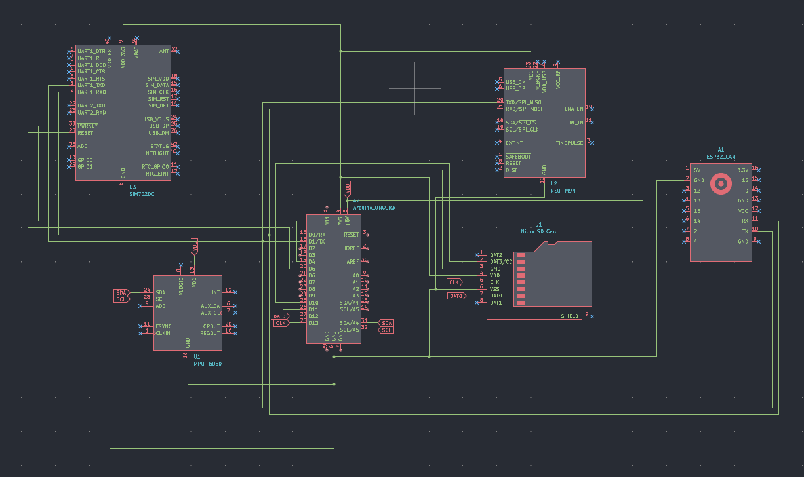

# Устройство контроля стиля вождения
---
### Задачи
- [ ] Актуальность
- [ ] Анализ аналогов
- [ ] Блок схема
- [ ] Структурная схема 
---
### Примеры компонентов

| Компонент                                                 | Цена   | URL                    | Описание                                                                           |
| --------------------------------------------------------- | ------ | ---------------------- | ---------------------------------------------------------------------------------- |
| MPU-6050                                                  | 359 ₽  | https://clck.ru/3PTnwj | Акселерометр и гироскоп для отслеживания перегрузок, резких ускорений и торможений |
| GPS/GLONAS NEO-7M с активной антенной                     | 1186 ₽ | https://clck.ru/3PToEv | GPS модуль с активной антенной.                                                    |
| Модуль зуммера Arduino                                    | 159 ₽  | https://clck.ru/3PTpg9 | Устройство вывода звука                                                            |
| Модуль ESP32-CAM с камерой                                | 787 ₽  | https://clck.ru/3PTq8c | Устройство наблюдения за вождением                                                 |
| Модуль камеры OV7670 для Arduino                          | 340 ₽  | https://clck.ru/3PTqLL | Устройство наблюдения за вождением                                                 |
| Модуль кард-ридера MICRO SD Ардуино / Card Reader Arduino | 164 ₽  | https://clck.ru/3PTqXW | micro SD карта для записи данных во время поездки                                  |
| Плата расширения GSM / GPRS shield SIM900 для Arduino     | 1094 ₽ | https://clck.ru/3PTrCS | Модуль GSM для передачи по мобильному интернету                                    |
| ESP32 ESP32-S3                                            | 687 ₽  | https://clck.ru/3PTsPg | Микроконтроллер                                                                    |

### Приципиальная схема

